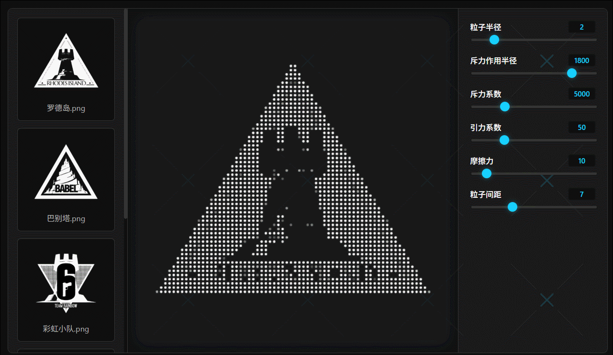
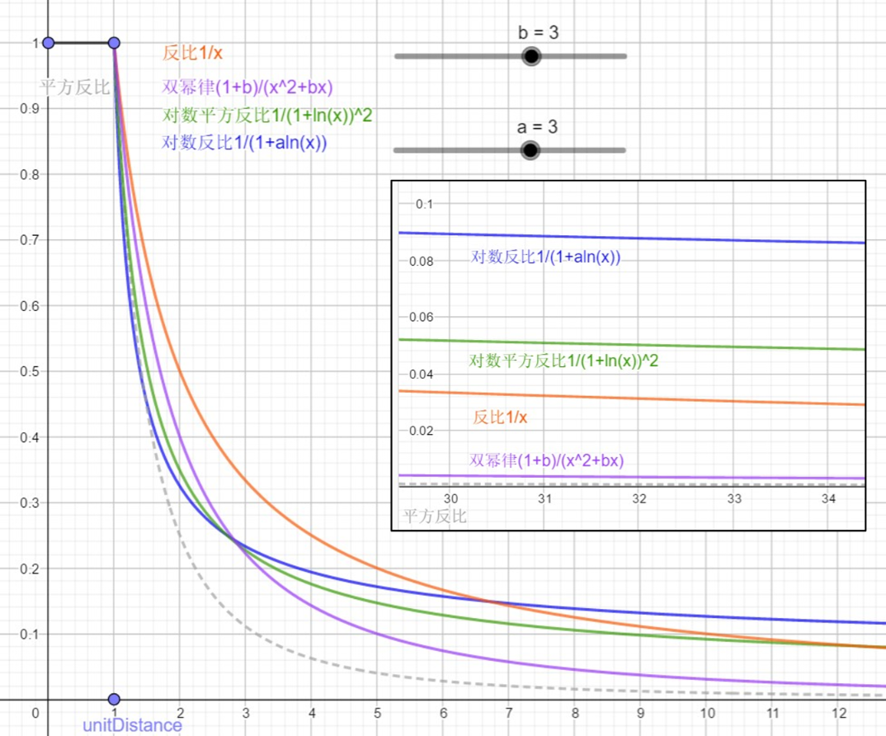

<h1> Dynamic Particle Image System</h1>

DPIS **交互式动态粒子图形系统**，灵感来自 [明日方舟官网](https://ak.hypergryph.com/#world) 。

DPIS 被设计为模块化的，便于嵌入前端。

本项目受到 [Arknights-FlowingPoints](https://github.com/BlackCoder0/Arknights-FlowingPoints) 的启发，在此致谢。

## 特性

-  **交互式动态**：粒子会基于指针和自身位置受力并运动
-  **图片切换动效**：支持动态切换图片，平滑过渡
-  **高度自定义**：提供丰富的参数配置，源码中更可自定义过滤器和复制规则
-  **响应式设计**：支持鼠标和触摸事件，适配移动端
-  **模块化架构**：核心逻辑与 UI 分离，易于集成到现有项目中



## 1. 快速开始

直接打开即可运行。  
演示页面提供了基础参数控制面板，您可以在控制面板中调整参数，实时查看效果。

演示页面支持：
- **选择预设图片**：点击下方图片列表切换不同图片
- **上传自定义图片**：点击列表中的上传按钮，选择本地图片文件加载

## 2. 进一步配置参数

### 2.1 基础参数列表

| 参数 | 推荐参考值 | 说明 |
|------|--------|------|
| `particleRadius` | 1.5 | 粒子显示半径(px) |
| `particleInterval` | 10 | 粒子间距(px) |
| `particleMassRange` | 0.5 | 粒子质量分布范围(±50%)，制造粒子间微小运动差异 |
| `repulsionRadius` | 1800 | 斥力最大作用距离(px) |
| `unitDistance` | 20 | 引力或斥力的单位作用距离(px) |
| `repulsionForce` | 5000 | 斥力强度(互动作用力强度) |
| `attractionForce` | 500 | 引力强度(恢复力系数) |
| `resistence` | 15 | 阻尼系数，与引力强度相比不应过小。 |
| `maxSpeed` | 1080 | 粒子最大速度(px/s)，防止过快。 |
| `forceLaw` | `inverse` | 外力力律，详见下方力律类型 |
| `offsetAngle` | 0 | 恢复力偏移角度(deg)，产生扭转效果 |
| `particleShape` | `circle` | 粒子形状，`circle`, `rect`, `triangle`, `cross` |

**参数模式建议**

更快的恢复（更硬）：
- 增加 `attractionForce`
- 适量增加 `resistent`

波动的Q弹的恢复：
- 增加 `attractionForce`
- 适量减小 `resistent`

光晕般的图像：
- 增加 `particleRadius`
- 减小到小于粒子直径 `particleInterval`
- 配合颜色过滤函数，例如保留色彩、透明度调节

抽象区域点阵：
- 大幅增大 `particleInterval`
- 很小的 `particleRadius`

### 2.2 力律类型

外力（斥力）遵循不同的衰减规律，可通过 `forceLaw` 参数选择：

| 力律 | 值 | 特点 |
|------|---|------|
| 反比律 | `inverse` | 远端作用适中，默认选择 |
| 对数反比律 | `logInverse` | 近端下降快，远端最平缓 |
| 平方反比律 | `squareInverse` | 下降快，很快趋于零 |
| 对数平方反比律 | `logSquareInverse` | 下降适中，远端平缓 |
| 双幂律 | `dualPower` | 近端下降慢，远端很低 |  

> 不同力律在近端和远端的衰减规律（典型参数）：
  

### 2.3 粒子形状

支持粒子形状调整，通过 `particleShape` 参数设置：
- `circle`（默认）：圆形粒子
- `rect`：矩形粒子
- `triangle`：三角形粒子
- `cross`：十字粒子

也可以通过自定义粒子绘制函数 `draw`，深度定制粒子绘制行为。

---

## 3. 深入研究

### 3.1 单粒子模型

#### 3.1.1 粒子属性

运动学属性：
// 构建图片时更新
- **原始位置 O** (`originalX`, `originalY`)：粒子的锚点位置
// 构建或绘制更新
- **当前位置 P** (`x`, `y`)：粒子的实时位置。向量 OP 称为相对坐标或偏移 r。
- **速度 v** (`vx`, `vy`)：粒子的运动速度

自有属性：
// OwnAttributes，初始化和调参时更新，绘制不更新
- **半径** (`radius`)：粒子的显示半径
- **形状** (`shape`)：粒子的绘制形状
- **质量 m** (`mass`)：粒子的质量，影响加速度

其他属性：
// 构建图片时更新
- **颜色** (`color`)：粒子的填充颜色

#### 3.1.2 粒子动力学

粒子运动遵循牛顿定律，受力方程为：

``` 总受力 F = 恢复力 g + 外力 f + 阻力 h ```

1. **恢复力(引力)**：线性恢复力，使粒子回到原始位置
    ```
    g(r) = -kg * m * |r|  *  r/|r|
    ```
    其中 kg 为引力系数（`attractionForce`），m 为粒子质量，
    调整粒子质量分布范围（`particleMassRange`）内的微小差异，可以制造粒子运动的微小差异，丰富动效。
    为恢复力增加偏移角度（`offsetAngle`），可以恢复过程具有一定的扭转效果
    ```
    g(r) = -kg * m * |r|  *  A(theta)*r/|r|
    ```

2. **外力(斥力)**：鼠标/触摸产生的斥力，通过 `forceLaw` 参数选择不同的衰减规律
    
    可选的力律及对应的 `forceLaw` 值：
    - 反比律 `inverse` ```f(d) = kf / |d/ud| * d/|d|```
    - 对数反比律 `logInverse` ```f(d) = kf / (1 + 3*log(|d/ud|)) * d/|d|```
    - 平方反比律 `squareInverse` ```f(d) = kf / |d/ud|² * d/|d|```
    - 对数平方反比律 `logSquareInverse` ```f(d) = kf / (1 + log(|d/ud|))² * d/|d|```
    - 双幂律 `dualPower` ```f(d) = kf * 4 / (|d/ud|*(|d/ud|+3)) * d/|d|```
    
    其中：
    - `kf` 为斥力系数（`repulsionForce`）
    - `d` 为粒子相对鼠标的位置向量(`x - mouseX`, `y - mouseY`)
    - `ud` 为单位作用距离（`unitDistance`），在此距离内斥力被限制为恒定值 `kf`

3. **阻力**：线性阻尼力，总是使粒子速度衰减
    ```
    h(v) = -kh * v
    ```
    其中 `kh` 为摩擦系数（`resistence`）

  **速度和位置更新**：
  ```
  v = v + F / m * dt
  P = P + (v + v_old) * dt / 2
  ```
### 3.2 DPIS模型
DPIS的核心是一群粒子。同时DPIS为粒子们提供参数配置，画布状态，图片数据，更新动画等外围服务。  

粒子采用动态扩容机制：初始时粒子群为空，随着需要按需创建。系统维护一个最小粒子数量阈值 `leastParticleNum`，用于避免频繁收缩/扩容。  

通过激活计数器管理粒子，实现外界无感的动态扩容/收缩。  

系统初始化时会构建闲置形态（`buildIdleStyle`），显示正态分布的白色粒子，形成视觉反馈。  

传入新图片后，`buildFromImage` 函数执行以下步骤：

1. **图片预处理**：缩放图片，居中适应画布
2. **网格采样**：根据粒子间距在图片上进行网格采样
3. **颜色提取**：获取采样点的 RGBA 值作为粒子颜色
4. **粒子激活与复用**：
   - 对于每个采样点，如果通过激活过滤则需要激活对应粒子，为了维护视觉连续性，采用一下两个策略
   - **复用策略**：优先从已激活区域随机选取粒子复用，造成既有粒子随机运动，最终转移到新图形位置的效果
   - **平滑过渡**：新激活的粒子会借用已有激活粒子的实时位置作为初始位置，加入绘制，避免突然出现在空白处
5. **过滤处理**：在赋值之前可以进行三种过滤，过滤规则可自定义。
    - **激活过滤**：根据 RGBA 值判断是否需要在此处放置一个粒子
    - **颜色过滤**：将 RGBA 进行后处理，例如灰度、二值化等
    - **位置过滤**：对位置做变换，可在视觉上改变"网格"结构

#### 3.2.1 自定义过滤函数

自定义过滤函数来实现特殊效果。修改 dpis.filterXxx 方法，实现自定义过滤规则。

```javascript
// 自定义激活过滤示例：只激活非蓝色不透明区域（例如地图上的大陆）
dpis.filterActivate = (r, g, b, a) => {
    return  b < 128 && a > 128;
};
```

```javascript
// 自定义颜色过滤示例：反相
dpis.filterColor = (r, g, b, a) => {
    const gray = 255 - Math.round((r + g + b) / 3);
    return `rgba(${gray}, ${gray}, ${gray}, ${a / 255})`;
};
```

```javascript
// 自定义位置过滤示例：映射到内接椭圆
dpis.filterPosition = (x, y, imgWidth, imgHeight) => {
    // 计算中心点和相对偏移
    const centerX = imgWidth / 2, centerY = imgHeight / 2;
    const dx = x - centerX, dy = y - centerY;
    
    // 纵轴附加直接返回，避免除0错误
    if (Math.abs(dx) < centerX/1000) return { x: centerX, y: centerY };
    const a = imgWidth / 2; // 半长轴
    const b = imgHeight / 2; // 半短轴
    const angle = Math.atan2(dy, dx); // (-π, π]
    // 椭圆极坐标极径
    const r = b / Math.sqrt(1 - (1-(b*b)/(a*a))*Math.pow(Math.cos(angle), 2));
    
    // 与边界矩形相交
    const slope = Math.abs(dy / dx);
    const aspectRatio = b / a;
    let boundaryDist = slope <= aspectRatio ? 
        Math.abs(a / Math.cos(angle)) :
        Math.abs(b / Math.sin(angle));
    
    // 按比例 r/d 映射到椭圆内
    const scale = r / boundaryDist;
    return { x: centerX + dx * scale, y: centerY + dy * scale };
};
```


## 许可证

MIT License